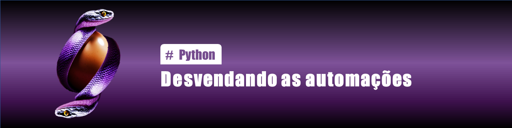

  

  
  

-------

# Projeto artigo técnico gerado por I.A.s

Projeto com o objetivo de gerar um artigo técnico com um layout rico, leitura agradável e com foco em promover sua autoridade técnica.

<a href="https://web.dio.me/articles/desvendando-as-automacoes-com-python?back=%2Farticles&open-modal=true&page=1&order=oldest" title="View PDF now"> 

 
📕Clique aqui para ler o artigo</a>

  

## 💻 Tecnologias utilizadas no projeto

- [ChatGPT](https://chat.openai.com/) - para título e conteúdo
- [Lexica.art](https://lexica.art/) - para gerar imagens
- [PowerPoint](https://www.microsoft.com/en/microsoft-365/powerpoint) - Para formatação de banners e Layouts

## 📄 Prompts e ferramentas

ChatGPT：

|   Ação   | prompt                                                                                                                                                                                                                                                                         |
| :------: | ------------------------------------------------------------------------------------------------------------------------------------------------------------------------------------------------------------------------------------------------------------------------------ |
|  título  | Crie 10 headlines para nomes de artigos sobre o assuntos Automações com Python 
|  título  | Atue como um profissional de TI com vasto conhecimento do assunto e gere tópicos a serem abordados para escrever um artigo destinado para esse assunto {ASSUNTO} Desvendando a Automação com Python 

  
Lexica.art：

- No léxica utilizei o acervo público de imagens geradas por outras pessoas, os termos de pesquisa que utilizei durante a gravação do conteúdo foram:

Python Code 

 

## ✨ Features

- Conteúdo gerado via ChatGPT
- Imagens do acervo público geradas via Lexica.art

## 📚 Materiais

- prompts gerados pelo ChatGPT

## 👨‍💻 Expert

    
&nbsp&nbsp&nbsp Felipe Oliveira 
    &nbsp&nbsp&nbsp
    <a href="https://github.com/felipeAguiarCode">
    GitHub</a>&nbsp;|&nbsp;
    <a href="https://github.com/FelipeOlli">LinkedIn</a>
&nbsp;|&nbsp;
    <a href="https://www.instagram.com/felipeolliver">
    Instagram</a>
&nbsp;|&nbsp;

  

---
